# Navjeevan Clinic Management System

A full-stack MERN healthcare platform that brings patients, doctors, and administrators together in one digital clinic system.

## Overview

Navjeevan Clinic is built with the MERN stack (MongoDB, Express, React, Node.js). Patients, doctors, and admins each get their own dashboard. The system covers appointment booking, digital prescriptions, medical records, health trackers, video consultations, online payments, reviews, and an AI chatbot.

## Features

### Patient
- Registration and login with Email OTP verification
- Profile management
- Appointment booking and rescheduling
- Medical report upload
- Digital prescriptions with download
- Period, fertility, pregnancy, and wellness trackers
- Video consultations
- Online payments through Razorpay
- Appointment reviews
- AI chatbot

### Doctor
- Doctor dashboard
- Patient and appointment management
- Patient medical history and reports
- Create or upload digital prescriptions
- Video consultations and appointment completion
- Patient search

### Administrator
- Admin dashboard
- Patient, doctor, and appointment management
- Review management
- System monitoring

## Video Consultations

Video appointments use Jitsi Meet, with access controlled by the server:

- The meeting link stays hidden until 5 minutes before the appointment.
- The doctor starts the consultation first. Until then, the patient sees a waiting screen.
- The consultation ends automatically after the service duration, the appointment is marked completed, and the meeting link is cleared.
- Rescheduling a video appointment resets its video session.

## Screenshots

| Home Page | About Page |
|---|---|
| 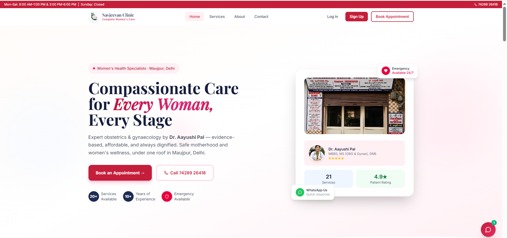 | 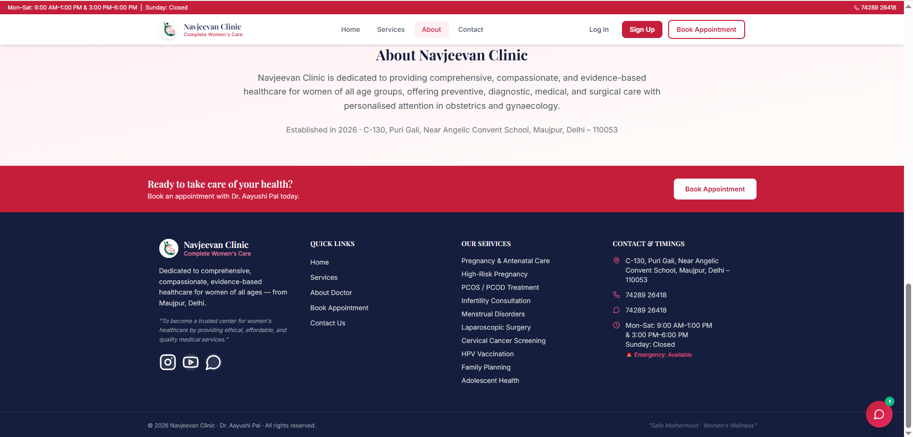 |

| Book Appointment | Appointment Confirmation |
|---|---|
| 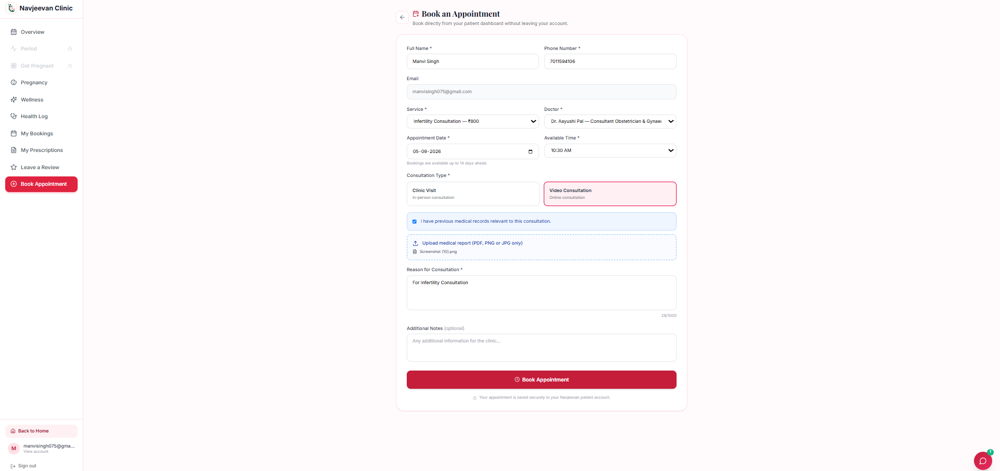 | 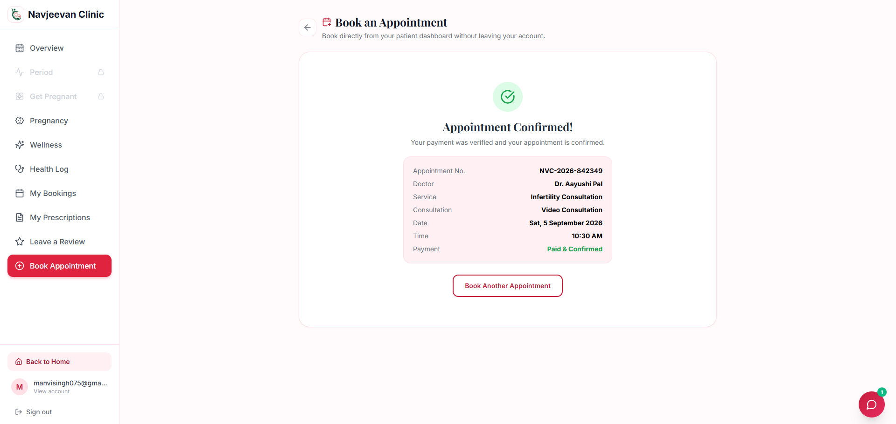 |

| Doctor Profile | Doctor Dashboard |
|---|---|
| 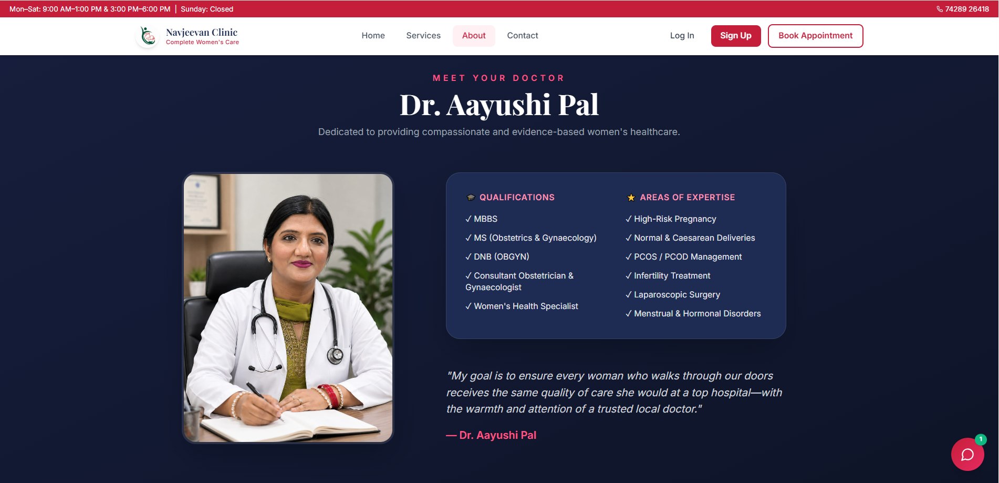 | 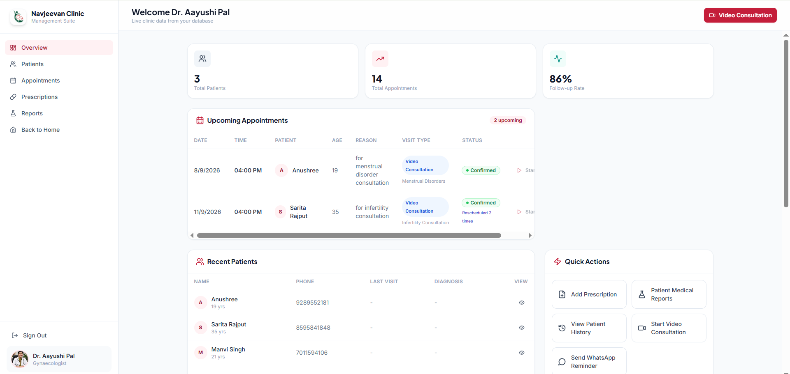 |

| Admin Dashboard | AI Chatbot |
|---|---|
| 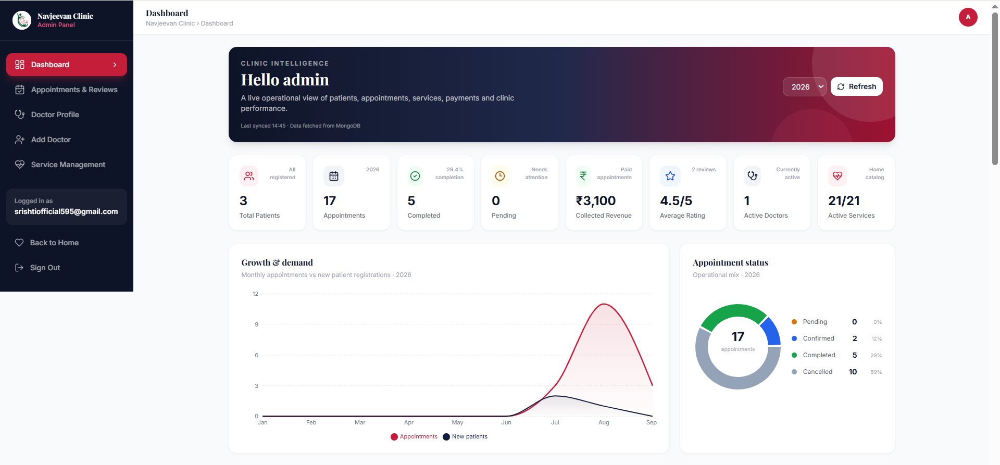 | 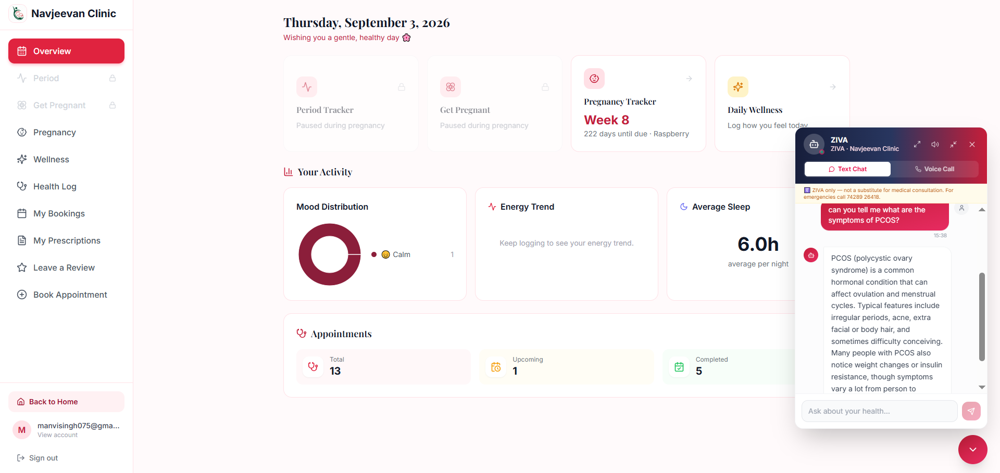 |

| Health Tracker | Fertility Tracker |
|---|---|
| 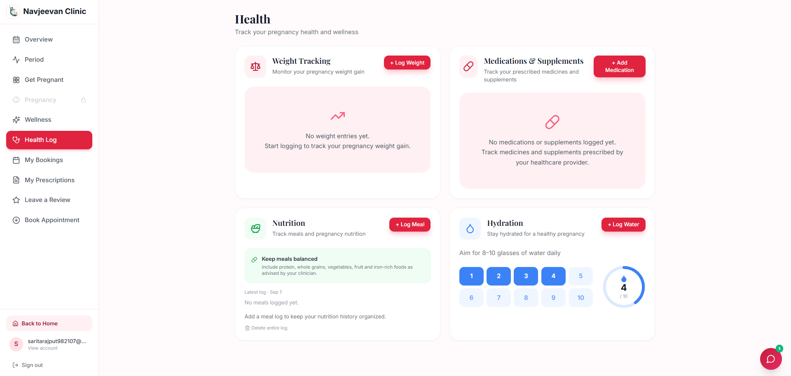 | 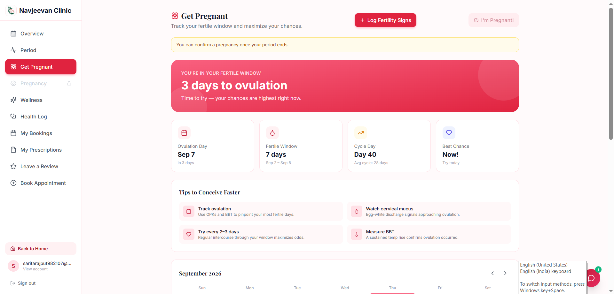 |

| Daily Wellness Tracker | Contact Page |
|---|---|
| 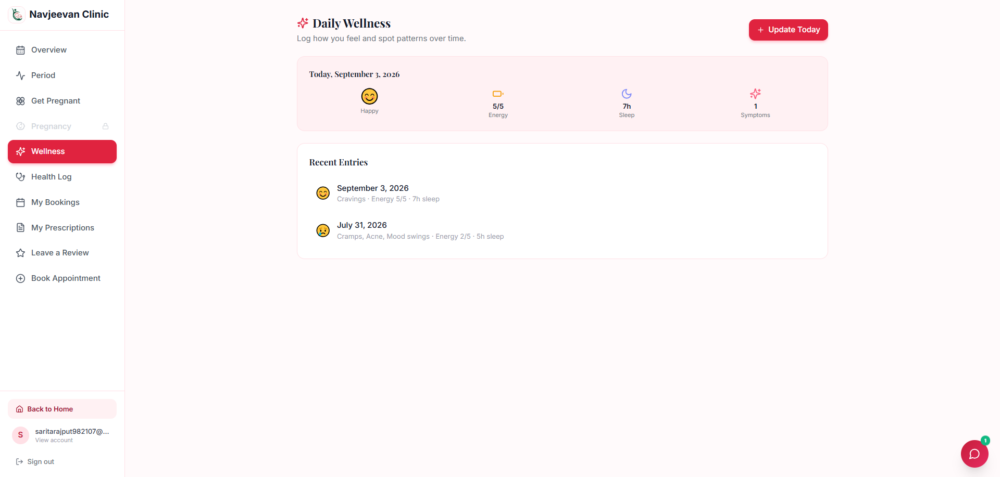 | 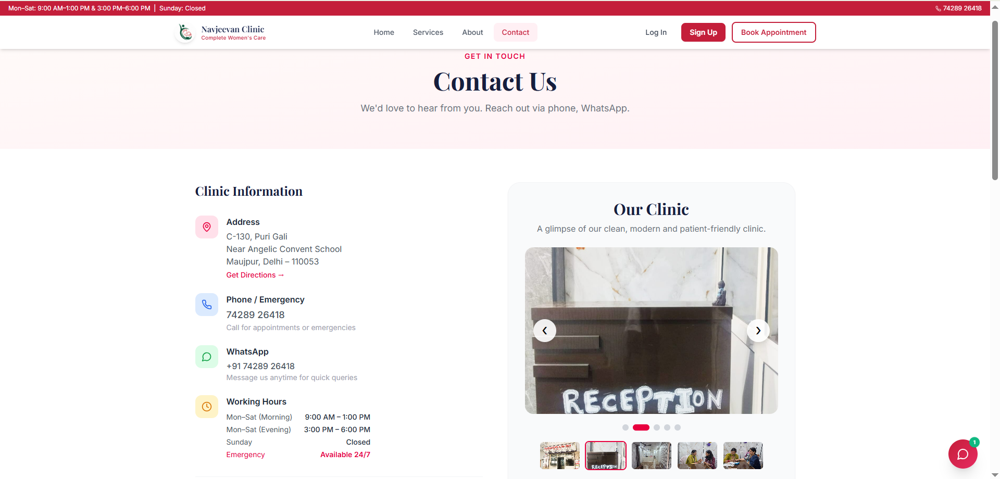 |

## Tech Stack

| Area | Technologies |
|---|---|
| Frontend | React 18, TypeScript, Vite, Tailwind CSS, React Router, Recharts, Lucide React |
| Backend | Node.js, Express |
| Database | MongoDB with Mongoose |
| Authentication | JWT, bcrypt, Email OTP |
| Email | Nodemailer (SMTP) |
| Payments | Razorpay |
| Video | Jitsi Meet |

## Project Structure

```
final/
├── client/        # React + TypeScript frontend
├── server/        # Express API, models, routes, services
└── screenshots/   # App screenshots
```

## Getting Started

### Requirements
- Node.js 18 or higher
- MongoDB (local or MongoDB Atlas)
- An SMTP account for sending OTP emails
- Razorpay keys if you want to test payments

### Setup

1. Clone the repository and install dependencies
   ```
   git clone https://github.com/ManviS00/Navjeevan-Clinic-Project.git
   cd Navjeevan-Clinic-Project/final/server
   npm install
   cd ../client
   npm install
   ```

2. Create a `.env` file in `final/server` with at least these values
   ```
   MONGODB_URI=your-mongodb-connection-string
   JWT_SECRET=a-long-random-secret
   EMAIL_HOST=smtp.gmail.com
   EMAIL_PORT=587
   EMAIL_USER=your-email@example.com
   EMAIL_PASS=your-app-password
   RAZORPAY_KEY_ID=your-razorpay-key-id
   RAZORPAY_KEY_SECRET=your-razorpay-key-secret
   ```
   For Gmail, use an App Password instead of your normal password. The AI chatbot needs its own API key as well.

3. (Optional) Add starter data
   ```
   cd final/server
   npm run seed:all
   ```
   The admin and doctor details in the seed scripts are placeholders. Replace them with your own before using the project.

4. Run the app
   ```
   # Terminal 1 - backend
   cd final/server
   npm run dev

   # Terminal 2 - frontend
   cd final/client
   npm run dev
   ```
